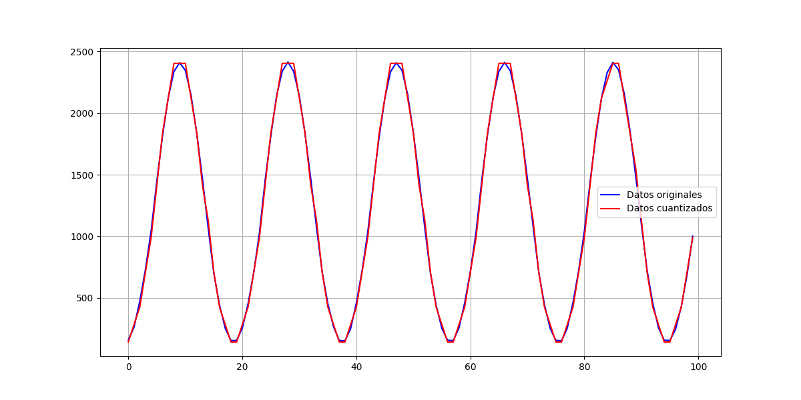

# 🎶 DSP Practice 1: ADC Sampling and UART

  

This project is the first practice in a Digital Signal Processing (DSP) series. It focuses on the fundamentals of signal acquisition, sampling, and data transmission using the Raspberry Pi Pico.

## 📝 Description

This project configures the RP2040 to act as a simple data acquisition device. It performs the following steps:

1.  **Initializes Peripherals:** Sets up the ADC, UART, and a repeating timer.
2.  **Periodic Sampling:** A timer interrupt triggers at a defined `SAMPLE_TIME` (e.g., every 100µs), ensuring consistent sampling frequency.
3.  **Signal Acquisition:** Inside the timer's callback, the program reads an analog value from the ADC.
4.  **Oversampling & Averaging:** To improve signal quality and reduce noise, it takes 4 quick ADC readings and averages them.
5.  **Data Transmission:** The resulting ADC value is sent over UART, which can be captured by a computer for analysis.

This project is complemented by Python scripts that can be used to receive the UART data, visualize it, and perform further DSP operations like quantization and simulation.

## 🛠️ Hardware & Software Requirements

### Hardware
- Raspberry Pi Pico or any RP2040-based board
- An analog signal source (e.g., function generator, sensor)
- A USB to TTL serial converter

### Software
- [Raspberry Pi Pico SDK](https://github.com/raspberrypi/pico-sdk)
- [CMake](https://cmake.org/)
- [ARM GCC Compiler](https://developer.arm.com/tools-and-software/open-source-software/developer-tools/gnu-toolchain/gnu-rm)
- [Python 3](https://www.python.org/) with `matplotlib`, `numpy`, and `pyserial` libraries.

## ⚙️ Pinout

| Function      | Pin (GPIO) | Description                              |
|---------------|------------|------------------------------------------|
| ⚡️ ADC Input    | 26         | Connect your analog signal here (0-3.3V) |
|  UART0 TX      | 0          | UART0 Transmit line                      |
|  UART0 RX      | 1          | UART0 Receive line                       |

## 🚀 How to Build and Run

1.  **Build the C code:**
    - Navigate to the `DSP/DSP_pract1` directory.
    - Create a `build` directory and run `cmake` and `make` as in the previous project.
    - Flash the generated `.uf2` file to your Pico.

2.  **Run the Python script:**
    - Connect the Pico's UART0 TX pin to your computer's serial-to-USB adapter.
    - Open the `practica1` folder.
    - Modify the `PUERTO` variable in the `practica1.py` script to match your serial port (e.g., `/dev/ttyACM0` on Linux or `COM3` on Windows).
    - Run the script:
      ```bash
      python practica1.py
      ```

## 🐍 Python Scripts

- **`practica1.py`:** Acquires the data sent by the Pico, performs quantization, and plots both the original and quantized signals.
- **`practica1_1.py`:** A simulation script that generates a sine wave, samples it, quantizes it, and visualizes the process.
- **`test_simu.py`:** Another simulation script for visualizing analog vs. sampled signals.

## 📊 Example Output

The C program will print the raw ADC values to the serial console:

```
2048
2050
2047
...
```

The Python script `practica1.py` will generate a plot (`img4_3.png`) showing the acquired signal and its quantized version.



---

This project provides a solid foundation for understanding the bridge between analog signals and the digital world. 🌉
