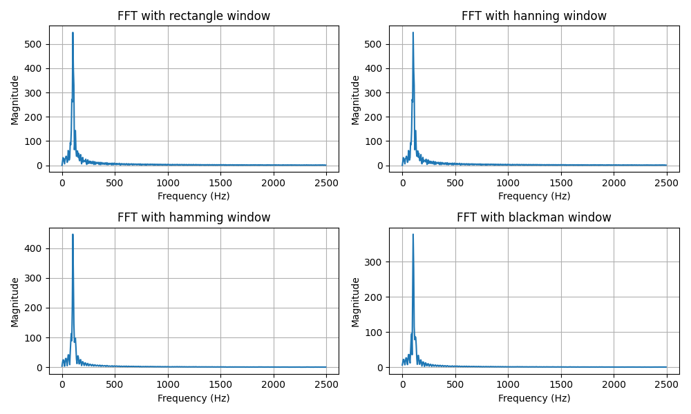

# 🌊 Signal Acquisition & Spectral Analysis

  

This project demonstrates a block-based signal acquisition system using the Raspberry Pi Pico, designed for spectral analysis. It captures a buffer of analog data and sends it to a host computer for advanced processing.

## 📝 Description

This project is a step up from simple, continuous ADC reading. It works in discrete blocks of data, which is a common paradigm in Digital Signal Processing.

1.  **Buffered Acquisition:** The Pico uses a repeating timer to sample an ADC channel at a rate of 5kHz (200µs period). These samples are stored in a `BUFFER_LENGTH` (1024 samples) buffer.
2.  **Block Transmission:** Once the buffer is full, the sampling timer stops, and the entire block of 1024 samples is transmitted over the USB-CDC interface (as `printf` output).
3.  **Restart Cycle:** After the data is sent, the buffer and associated flags are reset, and the sampling timer is restarted to capture the next block of data.

This method is highly efficient for tasks like FFT, as it provides a coherent block of data sampled at a constant rate.

## 🔬 Companion Python Scripts

The C code is the acquisition frontend for powerful Python-based analysis scripts:

- **`spectral_analysis.py`:** A feature-rich script that connects to the Pico's serial port, captures the data block, and performs spectral analysis. It allows you to:
    - Remove the DC component.
    - Apply various windowing functions (Rectangle, Hanning, Hamming, Blackman) to reduce spectral leakage.
    - Compute and plot the Fast Fourier Transform (FFT) of the signal.
    - Save the time-domain and frequency-domain plots.

- **`simu_fft.py`:** A simulation script to understand the effects of windowing and FFT on signals with different characteristics without needing the hardware. It's a great tool for learning the theory.

## 🛠️ Hardware & Software Requirements

### Hardware
- Raspberry Pi Pico or any RP2040-based board
- An analog signal source (e.g., function generator, sensor)
- USB cable to connect the Pico to your computer

### Software
- [Raspberry Pi Pico SDK](https://github.com/raspberrypi/pico-sdk)
- [CMake](https://cmake.org/)
- [ARM GCC Compiler](https://developer.arm.com/tools-and-software/open-source-software/developer-tools/gnu-toolchain/gnu-rm)
- [Python 3](https://www.python.org/) with `matplotlib`, `numpy`, and `pyserial` libraries.

## ⚙️ Pinout

| Function      | Pin (GPIO) | Description                              |
|---------------|------------|------------------------------------------|
| ⚡️ ADC Input    | 26         | Connect your analog signal here (0-3.3V) |
|  USB-CDC TX/RX | (internal) | Connect Pico via USB for data output     |

## 🚀 How to Build and Run

1.  **Build and Flash:**
    - Compile the C code in the `DSP/signal_adq` directory and flash the `.uf2` file to your Pico.

2.  **Run the Python Analysis:**
    - Navigate to the `practica2` directory.
    - Run the interactive analysis script:
      ```bash
      python spectral_analysis.py
      ```
    - Follow the on-screen prompts to connect to the Pico, acquire data, and generate plots.

## 📊 Example Output

The C program will output blocks of 1024 ADC values over USB serial:

```
1854
1923
2001
...
(1024 lines)
```

The `spectral_analysis.py` script will then generate beautiful plots, like this one showing the FFT with different window functions applied:



---

This project is a perfect example of how to use a microcontroller for serious data acquisition in a DSP context. 🧠
